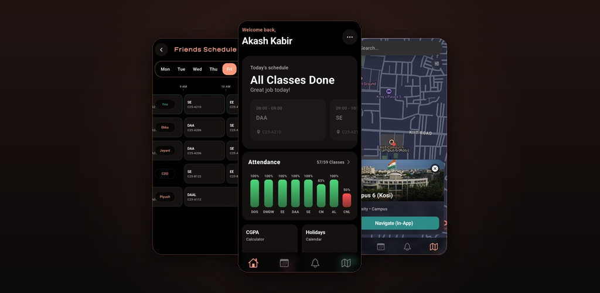
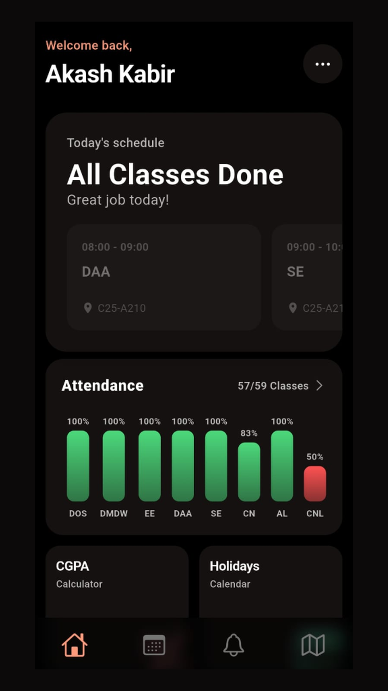
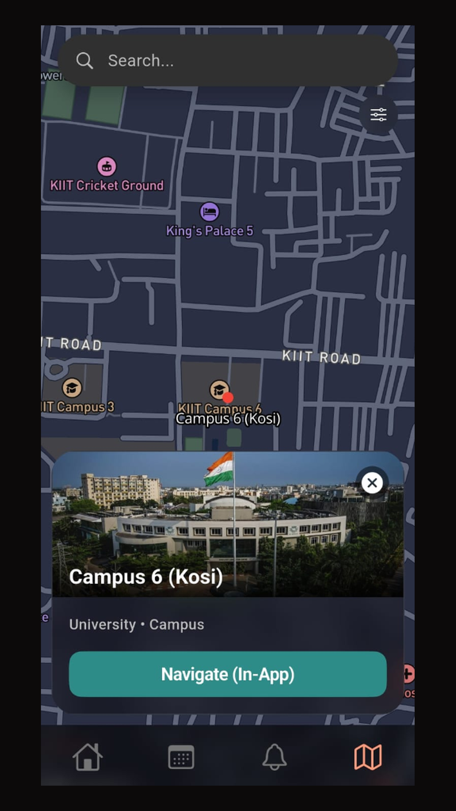
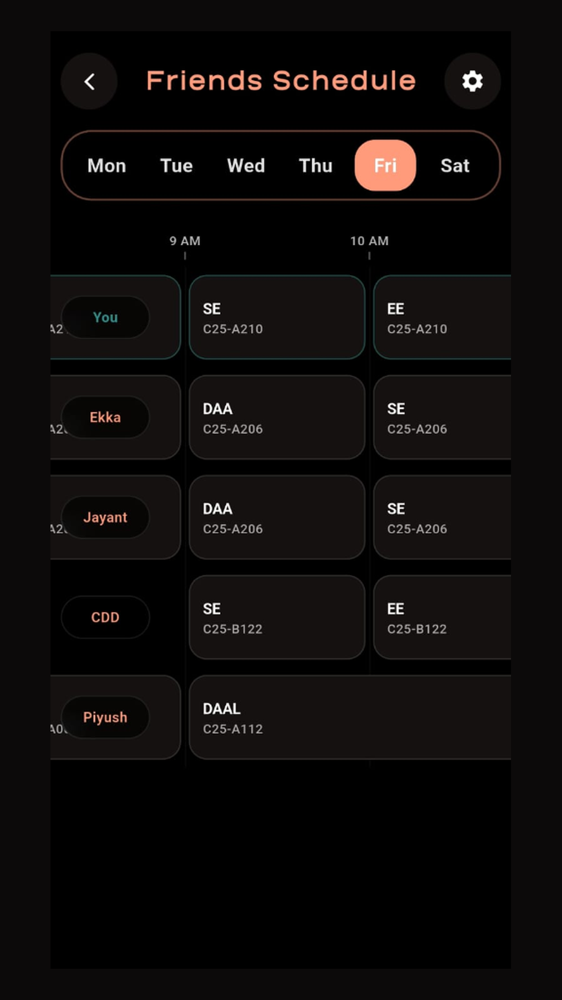

# EduMate - Student Companion App

<p align="center">
  
</p>

EduMate is a dark-mode-first mobile application designed to help university students manage their academic life. It is built using Flutter and integrates directly with student portals for local data synchronization without storing credentials on external servers.

## Visual Previews

<p align="center">
  
  
  
</p>

## Tech Stack
- **Framework:** Flutter (Dart)
- **State Management:** Provider
- **Local Databases:** SQLite (`sqflite`), SharedPreferences, FlutterSecureStorage (for secure local credential storage)
- **Map & Navigation:** Mapbox SDK
- **API Communication:** HTTP & Dio (with automatic JWT token refresh mechanism)
- **Background Sync:** `Workmanager` for periodic offline-first background task execution
- **Media Handling:** Image Picker, Image Cropper, and direct Cloudinary upload integration
- **Performance:** Optimized 120Hz rendering using `AnimatedBuilder`, `ShaderMask`, and `RepaintBoundary`

## Key Features

### 1) Authentication & Session Security
- Fully secure signup and login flows utilizing OTP (One-Time Password) email verification.
- Glassmorphic branding interface using smooth ambient animations.
- Secure token storage with automated token-refresh intercepts on 401 Unauthorized errors via `TokenRefreshService`.
- Account deletion compliant with Google Play Console regulations, enabling users to purge all remote database entries and local cache directly from the settings.

### 2) Automated Timetable & Attendance (SAPSync)
- **Zero-Backend Credential Sync:** Connects directly to the student portal on-device. Portal credentials are never sent to or stored on the EduMate backend; they remain encrypted locally.
- **Background Sync:** Periodic headless syncing (every 12 hours) ensures your attendance and schedule are always up-to-date even before you open the app.
- Client-side headless webview scraping of attendance and personalized timetables.
- Visual status cards showing attendance metrics, warning alerts for sub-75% subjects, and calculated skips left.

### 3) CGPA & GPA Calculator
- Multi-semester CGPA projection and semester GPA calculator.
- Highly customizable input sliders to estimate required grades.
- Built-in subject credit managers with localized caching.

### 4) Interactive Campus Maps & Navigation
- Mapbox-integrated custom campus layout.
- Points of Interest (POIs) search for lecture halls, laboratories, hostels, and grounds.
- GPS location tracking and live path-drawing/navigation routes.

### 5) Shared Schedules (Friends Timetable)
- Compare timetables with friends in real-time.
- Visual scheduler mapping out overlapping free slots for study sessions.

### 6) Events Feed & Media Upload
- Role-gated post creation feed (restricted to authenticated societies/contributors/admins).
- Direct client-side signed media upload to Cloudinary.

### 7) In-App Updates & Maintenance
- **Play Store Integration:** Seamless flexible in-app updates utilizing `in_app_update` to notify users of new versions upon app launch without interrupting their workflow.
- **Bug Reporting:** In-app feedback system for users to report bugs directly to developers.

### 8) Guest Accounts
- **Restricted Access:** Prospective students and parents can use the app as guests with limited 3-day access.
- **Automated Cascade Cleanup:** Backend automatically purges all guest data and associated local caching upon expiry.

## Project Directory Structure

```text
lib/
├── main.dart                       # App entry point
├── main_page.dart                  # Bottom navigation and auth wrapper
├── theme/                          # Color palettes & global themes
├── shared/                         # Shared services and utilities
│   ├── config.dart                 # Config endpoints & constants
│   ├── services/                   # SharedPreferences, DB helpers
│   ├── utils/                      # Validators & formatters
│   └── widgets/                    # Custom glass buttons, dialogs
└── features/                       # Modular feature folders
    ├── admin/                      # Admin panel & data upload tools
    ├── auth_and_profile/           # Signup, Login, Profile screens
    ├── events/                     # Events/News feed & Cloudinary uploads
    ├── feedback/                   # In-app bug/feedback reporting
    ├── friends/                    # Peer timetable sharing & gantt chart
    ├── home/                       # CGPA calculator & greeting dashboard
    ├── navigation/                 # Mapbox screens & route calculations
    ├── sapsync/                    # Webview portal scrapers & attendance cards
    ├── schedule/                   # Semester timetables & offline database
    ├── settings/                   # Custom settings & account deletion logic
    └── splash/                     # Animated start screens
```

## Setup & Running Locally

### Prerequisites
- Flutter SDK `^3.10.4`
- Android SDK & Gradle configured (Java 17 recommended)
- A Mapbox access token (configured in credentials)

### Quick Start
```bash
# Clone the repository
git clone <your-repo-url>
cd EduMateApp-FrontEnd/edumate

# Fetch dependencies
flutter pub get

# Launch the development version
flutter run
```

### Android Rendering Engine Note
As of Flutter 3.24+, Impeller is the default rendering engine for Android. However, due to its current poor performance with heavy animated `BackdropFilter` and `SaveLayer` operations, this app explicitly opts-out of Impeller and forces **Skia** in `AndroidManifest.xml` to maintain 120fps smooth performance on glassmorphic UI elements.

## Security & Architecture Details
To understand the detailed inner workings of the code architecture and how each modular feature is designed, see [features.md](features.md).

## License
Copyright © 2026 Mirza Akash Kabir. All rights reserved. 
This codebase is private and proprietary. Commercial use, modification, distribution, or reproduction without written permission is strictly prohibited. Refer to [LICENSE](LICENSE) for full legal terms.
